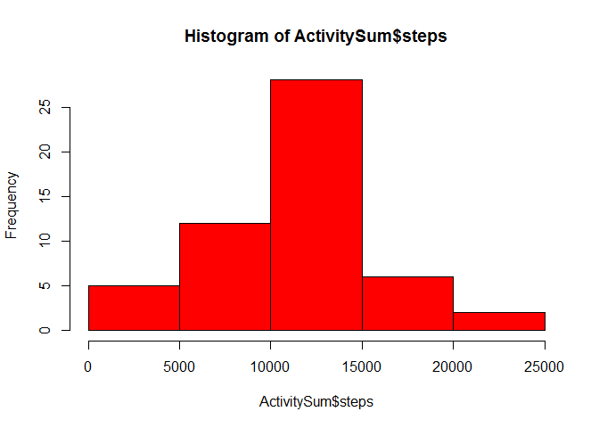
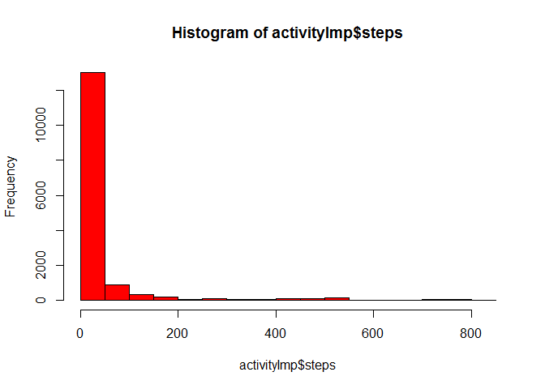
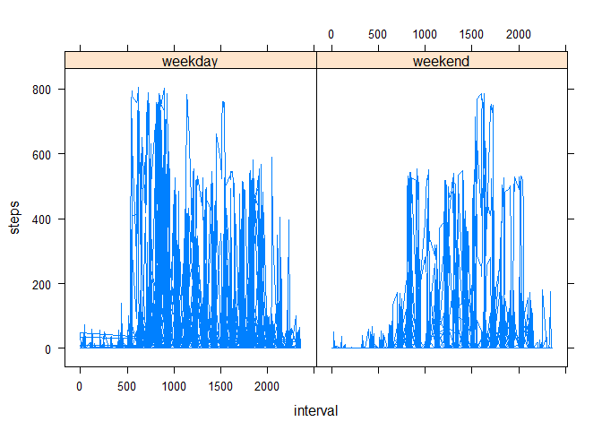

# Reproducible Research: Peer Assessment 1
Reem Sarrif  


## Loading and preprocessing the data
In this part we start by unzipping the file to extract the "activity.csv" file, 
then we read this into the data frame "activity".


```r
  unzip("activity.zip")
  activity <- read.csv("activity.csv")
  str(activity)
```

```
## 'data.frame':	17568 obs. of  3 variables:
##  $ steps   : int  NA NA NA NA NA NA NA NA NA NA ...
##  $ date    : Factor w/ 61 levels "2012-10-01","2012-10-02",..: 1 1 1 1 1 1 1 1 1 1 ...
##  $ interval: int  0 5 10 15 20 25 30 35 40 45 ...
```


## What is mean total number of steps taken per day?
The total number of steps taken per day is calculated, and a histogram is displayed to show the total number of steps taken each day.


```r
  ActivitySum <- aggregate(steps ~ date, data=activity, FUN="sum", na.rm=TRUE)

  hist(ActivitySum$steps, col="red")
```

 

Next we calculate the mean and median for total number of steps taken per day.
Note: the code chunk for this part is hidden and results shown below.


For the total number of steps taken per day, the mean is 10766.19 and the median is 10765


## What is the average daily activity pattern?
Here we calculate the mean for number of steps taken per 5-minute interval across all days.  Results plotted as time series plot.


```r
  ActivitySum <- aggregate(steps ~ interval, data=activity, FUN="mean", na.rm=TRUE)
  with(ActivitySum, plot(interval,steps, type="l"))
```

 

Next we find the interval with the maximum average number of steps.
Note: the code for this chunk is hidden and findings displayed below.


The 5-minute interval on average across all days that contains the maximum number of steps is interval 835


## Imputing missing values
Here we calculate the number of rows with NA values.


The total number of missing values in the dataset is 2304

In this part, we calculate the average steps for each interval, then for all rows with missing (NA) values, the appropriate average for that interval is used instead.


```r
  ActivitySum <- aggregate(steps ~ date, data=activity, FUN="mean", na.rm=TRUE)

  activityNA <- activity[is.na(activity$steps)==TRUE,]
  activityVAL <- activity[is.na(activity$steps)==FALSE,]
  
  activityNA <- merge(activityNA, ActivitySum, by="date")
  activityVAL <- merge(activityVAL, ActivitySum, by="date")

  activityNA$steps <- activityNA$steps.y
  activityVAL$steps <- activityVAL$steps.x

  activityImp <- rbind(activityNA, activityVAL)

  #activityImp <- merge(activity, ActivitySum, by="date")
  #activityImp$steps <- ifelse(is.na(activityImp$steps.x)==TRUE,activityImp$steps.y,activityImp$steps.x)
  head(activity)
```

```
##   steps       date interval
## 1    NA 2012-10-01        0
## 2    NA 2012-10-01        5
## 3    NA 2012-10-01       10
## 4    NA 2012-10-01       15
## 5    NA 2012-10-01       20
## 6    NA 2012-10-01       25
```

```r
  head(activityImp)
```

```
##         date steps.x interval steps.y steps
## 1 2012-10-02       0        0  0.4375     0
## 2 2012-10-02       0        5  0.4375     0
## 3 2012-10-02       0       10  0.4375     0
## 4 2012-10-02       0       15  0.4375     0
## 5 2012-10-02       0       20  0.4375     0
## 6 2012-10-02       0       25  0.4375     0
```

```r
  hist(activityImp$steps, col="red")
```

 

```r
  ActivitySumImp <- aggregate(steps ~ date, data=activityImp, FUN="sum", na.rm=TRUE)
```


For the total number of steps taken per day, the mean is 10766.19 and the median is 10765

TODO


## Are there differences in activity patterns between weekdays and weekends?
Yes, there is obviousely a difference in activity patterns between weekdays and weekends.


```r
  activity$daytype <- ifelse(weekdays(as.Date(activity$date)) %in% c("Saturday","Sunday"),"weekend","weekday")
  library(lattice)
  xyplot(steps ~ interval | daytype, data=activity, layout = c(2,1), type="l")
```

 


